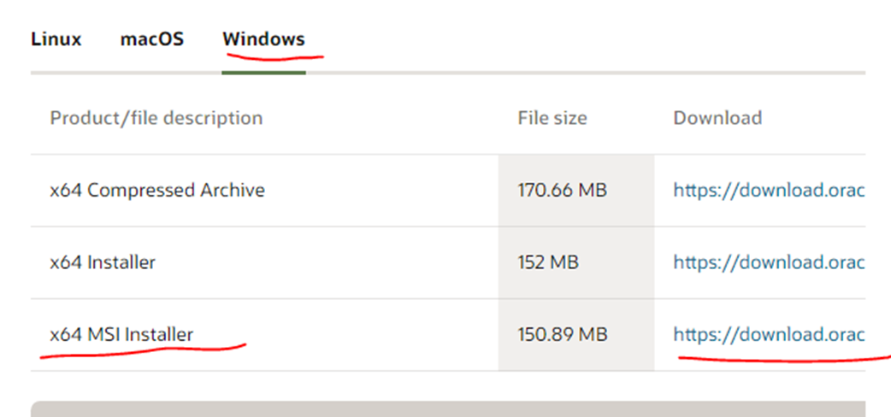
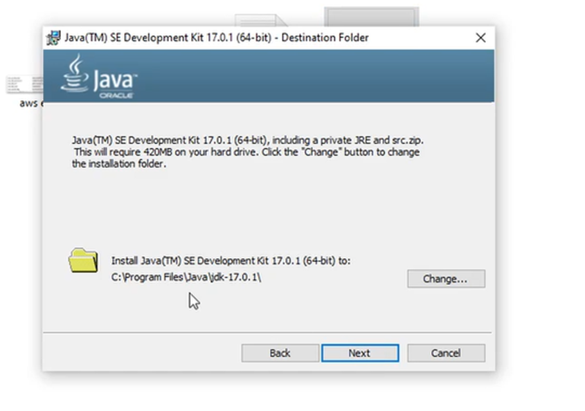
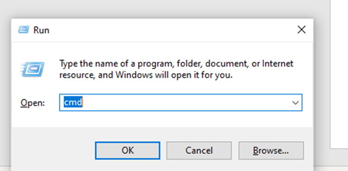
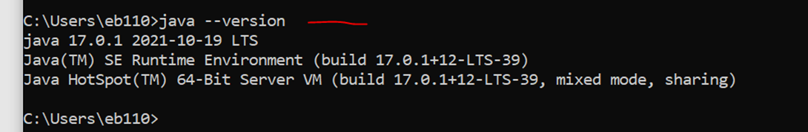
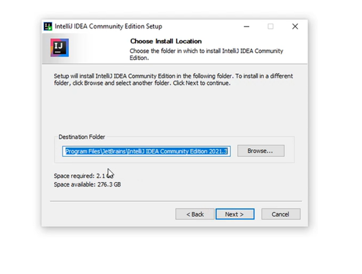
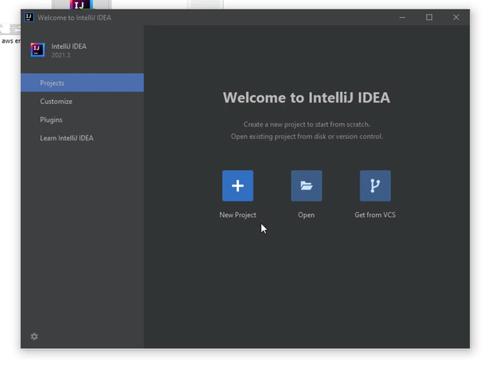

#01.JDK Installation

1.Go to: 

2.Click windows tab and pick MSI installer

3.Perform the installation with default settings.

4.Click windows plus r and type cmd in the search bar

5.Type java --version

#02.IntelliJ Installation

1.Go to:

2.Click download

3.Pick community version

4.Perform default installation

5.Run the application
